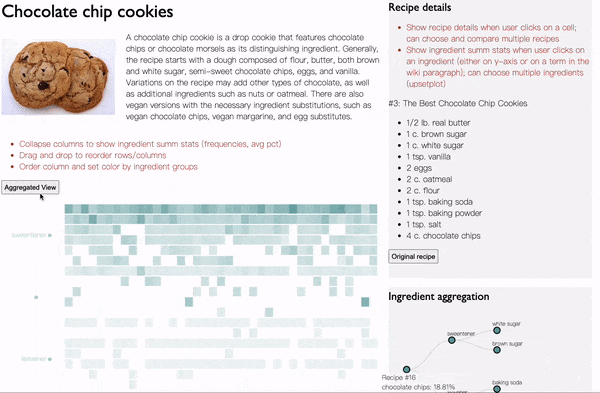
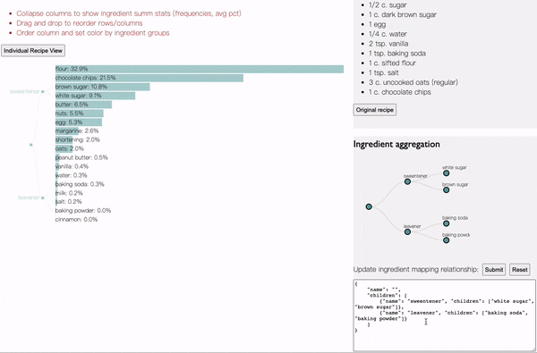
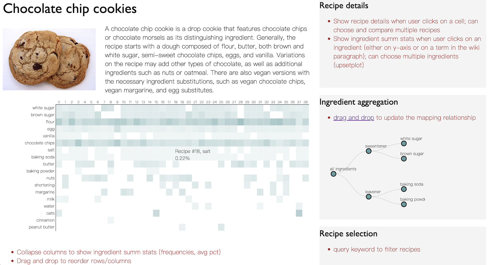
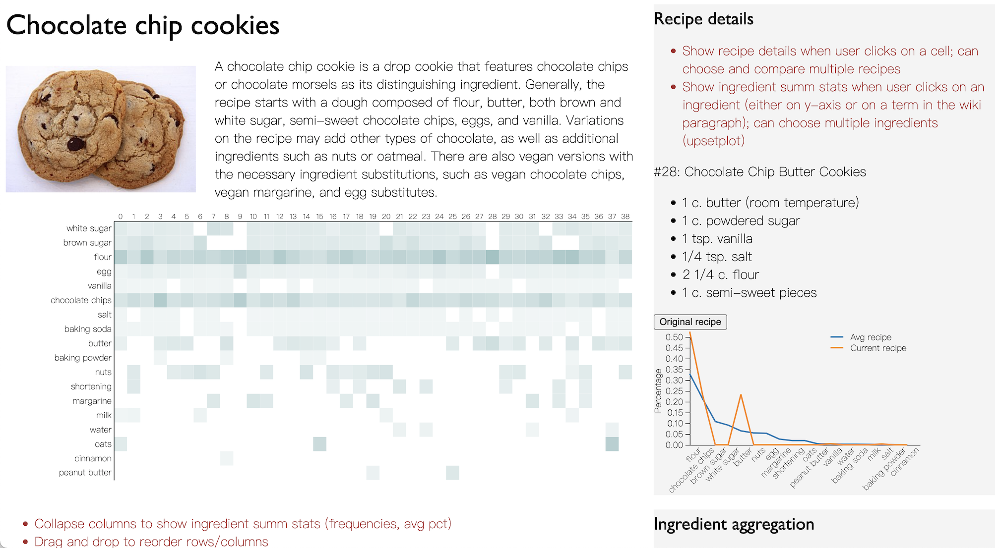

# RecipeVis: A Visual Tool for Understanding Food Items

*Ongoing research project*

What are some high-level rules that a food item follows? Is there a general formula for chocolate chip cookies? Which ingredients are the must-haves, the alternatives, or the fun and funky additions? This project aims to build an interactive visual tool that will allow users to explore and analyze crowdsourced recipes, and find answers to the above questions. 

## Changelog

### V2 (2022.04.14)

* Used Svelte framework to modularize code
    - Follow the code chunk below to install; run `npm run dev` to host

```bash
# install node.js if you have not
npx degit sveltejs/template svelte_example
cd svelte_example
npm instsall
# development
npm run dev
npm install d3
```

* Updated main visualization [demo]()
    - Added bar chart ([jsfiddle](https://jsfiddle.net/qd6xnpbt/1/); [svelte](https://svelte.dev/repl/25258d66b89b4bafbdb7ddc48fdf426d?version=3.46.5))
    - Added dendrogram as y-axis for both bar chart and heatmap



* Allowed user to customize ingredient-category mapping rules
    - User input ingredient map to dendrogram [demo](https://svelte.dev/repl/9c0b21a04f094d8291c9ed98f93f0254?version=3.46.5)
    - Test case:

```
{
    "name": "ingredients",
    "children": [
        {"name": "sweentener", "children": [
            "white sugar",
            "brown sugar"
        ]},
        {"name": "leavener", "children": [
            "baking soda", "baking powder"
		]},
		{"name": "fats", "children": [
			"butter", "margarine", "shortening"
		]},
		{"name": "liquids", "children": [
			"water", "milk"
		]}
    ]
}
```



### V1 (2022.03.17)





## Environment Setup

### Python Virtual Environment

```python
python3 -m venv env
source env/bin/activate
echo $VIRTUAL_ENV
which python3
which pip
```

## Todo

* To fix
    - Address scenario where the nodes in ingredient tree is not equal-depth
        - mainly affects unravel? root.descendants is a workaround
    - When there are more than 7 entries in the mapping relationships, the dendrogram becomes crowded
    - What if category and ingredient has the same name (e.g. flour)? One idea would be to convert and store ingredient as all cap
* Aggregate the "other" ingredients?
* Recipe compare view
* Add auto granularity adjustments as user zooms in or out
